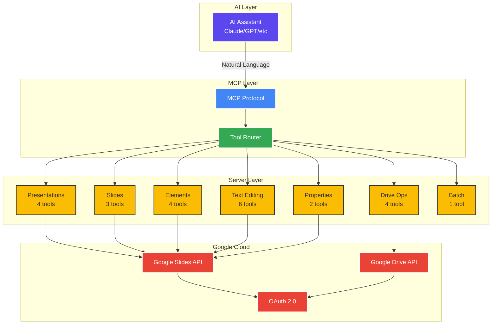

<div align="center">

# 🎨 Google Slides MCP Server

### **AI-Powered Presentation Automation**

*Programmatically create, edit, and manage Google Slides presentations through the Model Context Protocol*

<br>

[](https://nodejs.org/)
[](https://www.typescriptlang.org/)
[](https://modelcontextprotocol.io/)
[](https://developers.google.com/slides)

<br>

```ascii
┌─────────────────────────────────────────────────────────────────┐
│  🤖 AI Assistant  →  📡 MCP Protocol  →  🎨 Google Slides API  │
│                                                                  │
│  Natural Language  →  Structured Tools  →  Beautiful Slides    │
└─────────────────────────────────────────────────────────────────┘
```

[✨ Features](#-features) • [🏗️ Architecture](#️-architecture) • [🚀 Quick Start](#-quick-start) • [📚 Documentation](#-documentation) • [💡 Examples](#-examples)

</div>

<br>

---

<div align="center">

## 🌟 Overview

The **Google Slides MCP Server** bridges AI assistants with Google Slides, enabling automated presentation generation through natural language. Transform ideas into professional slide decks instantly.

</div>

<table>
<tr>
<td width="50%">

### 🎯 **Perfect For**

- 🤖 **AI-Powered Generation**  
  Let AI create entire decks from prompts
  
- 📊 **Automated Reporting**  
  Generate slides from data and analytics
  
- 🎓 **Educational Content**  
  Create course materials and training decks

</td>
<td width="50%">

### 💼 **Use Cases**

- 💼 **Business Automation**  
  Build sales decks and pitch presentations
  
- 🔄 **Template Workflows**  
  Programmatically populate slide templates
  
- 📈 **Dynamic Dashboards**  
  Real-time presentation updates

</td>
</tr>
</table>

---

<div align="center">

## 🏗️ Architecture

</div>



<br>

### **🔄 Request Flow**

```ascii
┌──────────────┐      ┌──────────────┐      ┌──────────────┐      ┌──────────────┐
│              │      │              │      │              │      │              │
│  AI Prompt   │─────▶│  MCP Tools   │─────▶│  API Client  │─────▶│ Google APIs  │
│              │      │              │      │              │      │              │
└──────────────┘      └──────────────┘      └──────────────┘      └──────────────┘
       │                     │                     │                     │
       │                     │                     │                     │
       │              ┌──────▼──────┐       ┌──────▼──────┐       ┌──────▼──────┐
       │              │  Validation │       │Rate Limiting│       │   OAuth     │
       │              │  (Zod)      │       │  & Retry    │       │   Token     │
       │              └─────────────┘       └─────────────┘       └─────────────┘
       │                                                                  │
       └──────────────────────────────────────────────────────────────────┘
                              ◀── Presentation Created ◀──
```

---

<div align="center">

## ✨ Features

</div>

<table>
<tr>
<td width="33%" align="center">

### 📑 **Presentations**

<br>

✅ Create & Copy  
✅ Delete & List  
✅ Export to PDF  
✅ Share & Permissions

</td>
<td width="33%" align="center">

### 🎯 **Slides**

<br>

✅ Add & Delete  
✅ Reorder Slides  
✅ Apply Layouts  
✅ Update Backgrounds

</td>
<td width="33%" align="center">

### 🎨 **Content**

<br>

✅ Text Boxes  
✅ Shapes & Images  
✅ Tables & Charts  
✅ Bullet Lists

</td>
</tr>
<tr>
<td width="33%" align="center">

### ✏️ **Text Editing**

<br>

✅ Insert & Delete  
✅ Find & Replace  
✅ Style Formatting  
✅ Paragraph Alignment

</td>
<td width="33%" align="center">

### 🔧 **Advanced**

<br>

✅ Batch Operations  
✅ Element Transforms  
✅ Rate Limiting  
✅ Error Handling

</td>
<td width="33%" align="center">

### 🛡️ **Reliability**

<br>

✅ Type Safety (TS)  
✅ Zod Validation  
✅ Auto Retry Logic  
✅ Quota Management

</td>
</tr>
</table>

<br>

<div align="center">

### **📊 24+ Tools Across 7 Categories**

```
Presentations (4) • Slides (3) • Elements (4) • Text (6) • Properties (2) • Drive (4) • Batch (1)
```

</div>

---

<div align="center">

## 🚀 Installation

### **Prerequisites**

</div>

<table>
<tr>
<td align="center" width="25%">

<br><b>Node.js 18+</b>
</td>
<td align="center" width="25%">

<br><b>GCP Project</b>
</td>
<td align="center" width="25%">

<br><b>Slides API</b>
</td>
<td align="center" width="25%">

<br><b>OAuth 2.0</b>
</td>
</tr>
</table>

<br>

<div align="center">

### **Quick Setup**

</div>

```bash
# 1️⃣ Clone the repository
git clone https://github.com/yourusername/google-slides-mcp.git
cd google-slides-mcp

# 2️⃣ Install dependencies
npm install

# 3️⃣ Build the project
npm run build

# 4️⃣ Authenticate (first time only)
npm start
```

---

<div align="center">

## 🔐 Google Cloud Setup

</div>

<table>
<tr>
<td width="25%" align="center">

### **1️⃣**
### Create Project

Go to [Google Cloud Console](https://console.cloud.google.com/)

Create a new project

</td>
<td width="25%" align="center">

### **2️⃣**
### Enable APIs

Enable:
- Google Slides API
- Google Drive API

</td>
<td width="25%" align="center">

### **3️⃣**
### OAuth Consent

Configure consent screen

Add test users

</td>
<td width="25%" align="center">

### **4️⃣**
### Get Credentials

Create OAuth 2.0 Client

Download as `credentials.json`

</td>
</tr>
</table>

<details>
<summary><b>📖 Detailed Setup Instructions</b></summary>

<br>

### 1. Create a Google Cloud Project

1. Go to [Google Cloud Console](https://console.cloud.google.com/)
2. Click **"Create Project"** and name it (e.g., `mcp-slides-server`)
3. Select the project from the dropdown

### 2. Enable Required APIs

Navigate to **APIs & Services > Library** and enable:
- ✅ **Google Slides API**
- ✅ **Google Drive API**

### 3. Configure OAuth Consent Screen

1. Go to **APIs & Services > OAuth consent screen**
2. Choose **External** (or Internal if using Google Workspace)
3. Fill in required fields:
   - App name: `Google Slides MCP Server`
   - User support email: Your email
   - Developer contact: Your email
4. Add your email as a **test user** (if using External)
5. Click **Save and Continue**

### 4. Create OAuth 2.0 Credentials

1. Go to **APIs & Services > Credentials**
2. Click **Create Credentials > OAuth client ID**
3. Application type: **Desktop app**
4. Name: `MCP Server Client`
5. Click **Create**
6. Download the JSON file and save it as `credentials.json` in the project root

</details>

---

<div align="center">

## ⚡ Quick Start

### **1️⃣ Authenticate**

</div>

Run the server for the first time to authenticate:

```bash
npm start
```

The server will:
1. Display an authentication URL
2. Open it in your browser
3. Ask you to grant permissions
4. Save the token to `token.json` automatically

<br>

<div align="center">

### **2️⃣ Configure Your MCP Client**

</div>

<table>
<tr>
<td width="50%">

#### **Claude Desktop**

Add to `claude_desktop_config.json`:

```json
{
  "mcpServers": {
    "google-slides": {
      "command": "node",
      "args": [
        "/absolute/path/to/google-slides-mcp/dist/index.js"
      ],
      "env": {
        "GOOGLE_CREDENTIALS": "/absolute/path/to/credentials.json"
      }
    }
  }
}
```

</td>
<td width="50%">

#### **Cline (VS Code)**

Add to MCP settings:

```json
{
  "mcpServers": {
    "google-slides": {
      "command": "node",
      "args": [
        "C:\\path\\to\\google-slides-mcp\\dist\\index.js"
      ],
      "env": {
        "GOOGLE_CREDENTIALS": "C:\\path\\to\\credentials.json"
      }
    }
  }
}
```

</td>
</tr>
</table>

<br>

<div align="center">

### **3️⃣ Start Creating!**

Once configured, use natural language prompts with your AI assistant:

</div>

<table>
<tr>
<td width="50%">

```
💬 "Create a new presentation 
    titled 'Q4 Sales Report'"
```

```
💬 "Add a title slide with 
    'Welcome to Our Product Launch'"
```

</td>
<td width="50%">

```
💬 "Add a slide with bullet points 
    about our key features"
```

```
💬 "Insert an image from 
    https://example.com/logo.png"
```

</td>
</tr>
</table>

---

<div align="center">

## 📚 Documentation

### **Available Tools**

</div>

<details open>
<summary><b>📑 Presentation Management (4 tools)</b></summary>

<br>

| Tool | Description |
|------|-------------|
| `create_presentation` | Create a new presentation with a title |
| `get_presentation` | Retrieve presentation details by ID |
| `copy_presentation` | Duplicate an existing presentation |
| `delete_presentation` | Permanently delete a presentation |

</details>

<details>
<summary><b>🎯 Slide Operations (3 tools)</b></summary>

<br>

| Tool | Description |
|------|-------------|
| `create_slide` | Add a new slide with optional layout |
| `delete_slide` | Remove a slide from the presentation |
| `reorder_slides` | Change slide position in the deck |

</details>

<details>
<summary><b>🎨 Content Elements (4 tools)</b></summary>

<br>

| Tool | Description |
|------|-------------|
| `add_text_box` | Add a text box with custom styling |
| `add_shape` | Insert shapes (rectangles, circles, arrows, etc.) |
| `add_image` | Add images from URLs |
| `add_table` | Create tables with rows and columns |

</details>

<details>
<summary><b>✏️ Text Editing (6 tools)</b></summary>

<br>

| Tool | Description |
|------|-------------|
| `insert_text` | Insert text into an element |
| `delete_text` | Remove text from an element |
| `replace_all_text` | Find and replace text globally |
| `update_text_style` | Apply font, size, color, and formatting |
| `update_paragraph_style` | Set alignment and line spacing |
| `create_bullets` | Add bullet points with preset styles |

</details>

<details>
<summary><b>🔧 Properties & Transforms (2 tools)</b></summary>

<br>

| Tool | Description |
|------|-------------|
| `update_page_properties` | Change slide background color |
| `update_element_transform` | Move, resize, or rotate elements |

</details>

<details>
<summary><b>💾 Drive Operations (4 tools)</b></summary>

<br>

| Tool | Description |
|------|-------------|
| `list_presentations` | List presentations from Google Drive |
| `export_presentation` | Export presentation as PDF |
| `update_permissions` | Share presentation with users |
| `delete_presentation` | Delete presentation from Drive |

</details>

<details>
<summary><b>⚡ Batch Operations (1 tool)</b></summary>

<br>

| Tool | Description |
|------|-------------|
| `batch_update` | Execute multiple operations atomically |

</details>

<br>

<div align="center">

### **📖 Full API Reference**

For detailed parameter documentation and examples, see **[API_REFERENCE.md](./docs/API_REFERENCE.md)**

</div>

---

<div align="center">

## 💡 Examples

### **Example 1: Create a Simple Presentation**

</div>

```typescript
// Create presentation
const presentation = await create_presentation({ 
  title: "My First Deck" 
});

// Add title slide
const slide1 = await create_slide({
  presentationId: presentation.presentationId,
  layout: "TITLE_SLIDE"
});

// Add title text
await add_text_box({
  presentationId: presentation.presentationId,
  slideId: slide1.slideId,
  text: "Welcome to My Presentation",
  x: 1, y: 2, width: 8, height: 1,
  fontSize: 36,
  bold: true
});
```

<br>

<div align="center">

### **Example 2: Create a Data Slide with Table**

</div>

```typescript
// Add blank slide
const slide = await create_slide({
  presentationId: presentationId,
  layout: "BLANK"
});

// Add table
const table = await add_table({
  presentationId: presentationId,
  slideId: slide.slideId,
  rows: 4, columns: 3,
  x: 1, y: 1.5, width: 8, height: 3
});

// Populate table cells (using batch_update for efficiency)
await batch_update({
  presentationId: presentationId,
  requests: [
    {
      insertText: {
        objectId: table.elementId,
        cellLocation: { rowIndex: 0, columnIndex: 0 },
        text: "Product"
      }
    },
    {
      insertText: {
        objectId: table.elementId,
        cellLocation: { rowIndex: 0, columnIndex: 1 },
        text: "Revenue"
      }
    }
    // ... more cells
  ]
});
```

<br>

<div align="center">

### **Example 3: Add Image and Style It**

</div>

```typescript
// Add image
const image = await add_image({
  presentationId: presentationId,
  slideId: slideId,
  imageUrl: "https://example.com/chart.png",
  x: 2, y: 2, width: 6, height: 3
});

// Reposition if needed
await update_element_transform({
  presentationId: presentationId,
  elementId: image.elementId,
  x: 2.5, y: 2.5, width: 5, height: 2.5
});
```

<br>

<div align="center">

### **Example 4: Batch Operations for Complex Slides**

</div>

```typescript
// Create multiple elements atomically
await batch_update({
  presentationId: presentationId,
  requests: [
    {
      createShape: {
        objectId: "title-box",
        shapeType: "TEXT_BOX",
        elementProperties: {
          pageObjectId: slideId,
          transform: { 
            translateX: 914400, translateY: 914400, 
            scaleX: 7315200, scaleY: 914400, 
            unit: "EMU" 
          }
        }
      }
    },
    {
      insertText: {
        objectId: "title-box",
        text: "Key Metrics",
        insertionIndex: 0
      }
    },
    {
      updateTextStyle: {
        objectId: "title-box",
        textRange: { type: "ALL" },
        style: { 
          fontSize: { magnitude: 28, unit: "PT" }, 
          bold: true 
        },
        fields: "fontSize,bold"
      }
    }
  ]
});
```

---

<div align="center">

## 🛠️ Development

### **Project Structure**

</div>

```
google-slides-mcp/
├── src/
│   ├── index.ts              # Main server entry point
│   ├── auth.ts               # OAuth authentication
│   ├── google-client.ts      # Google API client setup
│   ├── mcp/
│   │   ├── router.ts         # MCP request routing
│   │   └── types.ts          # MCP type definitions
│   ├── tools/
│   │   ├── presentations.ts  # Presentation management tools
│   │   ├── slides.ts         # Slide operations
│   │   ├── elements.ts       # Content elements
│   │   ├── text.ts           # Text editing and styling
│   │   ├── properties.ts     # Page properties and transforms
│   │   ├── batch.ts          # Batch operations
│   │   └── drive.ts          # Google Drive operations
│   └── utils/
│       ├── validators.ts     # Input validation
│       ├── errors.ts         # Error handling
│       ├── retry.ts          # Retry logic
│       ├── rate-limiter.ts   # API rate limiting
│       └── debug-logger.ts   # Debug logging
├── dist/                     # Compiled JavaScript
└── docs/                     # Documentation
```

<br>

<div align="center">

### **Scripts**

</div>

```bash
npm run build    # Compile TypeScript to JavaScript
npm run dev      # Run in development mode with tsx
npm start        # Run the compiled server
```

<br>

<div align="center">

### **Environment Variables**

</div>

Create a `.env` file for optional configuration:

```env
GOOGLE_CREDENTIALS=./credentials.json
CALLMISSED=true  # Enable debug logging
```

---

<div align="center">

## 🔒 Security

</div>

<table>
<tr>
<td width="50%" align="center">

### ⚠️ **Important Security Notes**

✅ **Never commit** `credentials.json` or `token.json`  
✅ Both files are in `.gitignore` by default  
✅ `credentials.json` contains OAuth client secrets  
✅ `token.json` contains access and refresh tokens  
✅ Keep these files secure and private

</td>
<td width="50%" align="center">

### 🔄 **Token Management**

Tokens are automatically refreshed when expired

If authentication fails, delete `token.json` and re-authenticate:

```bash
rm token.json
npm start
```

</td>
</tr>
</table>

---

<div align="center">

## 📊 Rate Limits

The server includes built-in rate limiting to respect Google API quotas:

</div>

| API | Limit | Handling |
|-----|-------|----------|
| **Google Slides API** | 60 requests/minute | Automatic retry with exponential backoff |
| **Google Drive API** | 100 requests/minute | Automatic retry with exponential backoff |

<div align="center">

The server automatically handles rate limit errors and retries failed requests.

</div>

---

<div align="center">

## 🐛 Troubleshooting

</div>

<details>
<summary><b>❌ Authentication Errors</b></summary>

<br>

**Problem:** `Authentication required: no valid token found`

**Solution:**
1. Ensure `credentials.json` exists in the project root
2. Delete `token.json` and re-authenticate:
   ```bash
   rm token.json
   npm start
   ```
3. Verify your email is added as a test user in OAuth consent screen

</details>

<details>
<summary><b>❌ API Not Enabled</b></summary>

<br>

**Problem:** `Google Slides API has not been used in project...`

**Solution:**
1. Go to [Google Cloud Console](https://console.cloud.google.com/)
2. Enable **Google Slides API** and **Google Drive API**
3. Wait a few minutes for changes to propagate

</details>

<details>
<summary><b>❌ Quota Exceeded</b></summary>

<br>

**Problem:** `Quota exceeded for quota metric...`

**Solution:**
- The server automatically retries with exponential backoff
- Reduce request frequency if hitting limits consistently
- Check quota usage in Google Cloud Console
- Consider requesting quota increases for production use

</details>

<details>
<summary><b>❌ MCP Client Not Detecting Server</b></summary>

<br>

**Problem:** Server not appearing in MCP client

**Solution:**
1. Verify absolute paths in configuration (no relative paths)
2. Ensure `dist/index.js` exists (run `npm run build`)
3. Restart your MCP client after configuration changes
4. Check client logs for connection errors

</details>

---

<div align="center">

## 🤝 Contributing

Contributions are welcome! Here's how you can help:

</div>

1. **Fork the repository**
2. **Create a feature branch** (`git checkout -b feature/amazing-feature`)
3. **Commit your changes** (`git commit -m 'Add amazing feature'`)
4. **Push to the branch** (`git push origin feature/amazing-feature`)
5. **Open a Pull Request**

<div align="center">

### **Development Guidelines**

</div>

- Follow existing code style and TypeScript conventions
- Add tests for new features
- Update documentation for API changes
- Ensure all tools have proper error handling
- Use Zod for input validation

---

<div align="center">

## 🙏 Acknowledgments

</div>

<table>
<tr>
<td align="center" width="33%">

**Built with**

[Model Context Protocol](https://modelcontextprotocol.io/)

</td>
<td align="center" width="33%">

**Powered by**

[Google Slides API](https://developers.google.com/slides)

</td>
<td align="center" width="33%">

**Uses**

[Google Drive API](https://developers.google.com/drive)

</td>
</tr>
</table>

---

<div align="center">

## 📞 Support

</div>

<table>
<tr>
<td align="center" width="33%">

### 🐛 **Issues**

[Report a Bug](https://github.com/yourusername/google-slides-mcp/issues)

</td>
<td align="center" width="33%">

### ⭐ **Star Us**

If you find this useful!

</td>
</tr>
</table>

---

<div align="center">

<br>

**Made with ❤️ for the MCP community**

<br>

[](https://github.com/yourusername/google-slides-mcp/stargazers)
[](https://github.com/yourusername/google-slides-mcp/network/members)

<br>

[⬆ Back to Top](#-google-slides-mcp-server)

</div>
