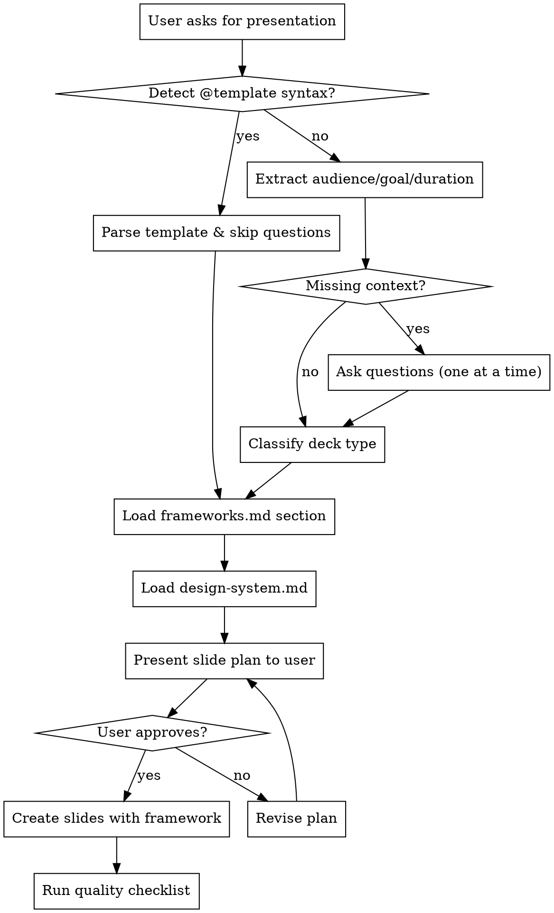

# Presentation Design Orchestrator

Determine the right presentation framework and design system before creating any slides.

<HARD-GATE>
Do NOT create a single slide, add text, or modify any presentation until you have:
1. Detected or asked for the presentation context (audience, goal, duration)
2. Classified the deck type
3. Loaded the complete framework and design system for that type
4. Presented a slide-by-slide plan to the user and gotten approval

This applies to EVERY presentation request regardless of perceived simplicity.
</HARD-GATE>

## Anti-Pattern: "I'll Just Start Making Slides"

Jumping straight into slide creation without a framework produces generic, ineffective presentations. The result is feature-dumping, missing narrative structure, wrong audience focus, and poor visual design. Even "just add a title" requests benefit from framework alignment.

## Checklist

You MUST create a task for each of these items and complete them in order:

1. **Detect context** — Parse user request for audience, goal, duration, template syntax
2. **Ask missing questions** — One at a time, multiple choice preferred (see Question Bank)
3. **Classify deck type** — Match audience+goal to framework (see Classification Table)
4. **Load framework** — Read `frameworks.md` for the specific deck type sections
5. **Load design system** — Read `design-system.md` for colors, fonts, spacing
6. **Load visual principles** — Read `visual-principles.md` for visual-first thinking and golden rules
7. **Determine visual approach per slide** — For each slide, ask "What visual best shows this?" before writing text. Use `image-prompts.md` for generation prompts.
8. **Present slide plan** — Show the user the proposed slide structure with action titles and visual strategy
9. **Generate structured DeckPlan JSON** — Save the plan as JSON with deck metadata, slides array, and approval state
10. **Run quality checklist against the structured plan**
11. **Validate layout calculations** — Use `layout-calculator.md` to verify text fits in proposed boxes (check char counts, line counts, font sizes against safe dimensions)
12. **Present human-readable review markdown**
13. **Get user approval on the structured plan** — Wait for explicit approval before execution
14. **Execute plan via Google Slides MCP tools**
15. **Persist DeckState mapping actual Google Slide IDs** — After creation, map planned slide IDs to actual Google Slides IDs

## Process Flow



## Step 1: Detect Context

Parse the user's request for:

- **Template syntax**: `@deck-type [parameters]`
  - `@pitch-deck industry stage slides` → Skip questions, load pitch framework
  - `@sales-deck product audience` → Skip questions, load sales framework
  - `@training-deck topic duration level` → Skip questions, load training framework
  - `@conference-deck topic duration style` → Skip questions, load conference framework
  - `@data-deck topic metrics frequency` → Skip questions, load data framework

- **Audience keywords**: investors, VCs, angels, customers, prospects, team, employees, students, trainees, conference, keynote, executives, board, C-suite
- **Goal keywords**: raise money, funding, sell, teach, train, onboard, inform, persuade, inspire, present data, quarterly review, share research, report metrics
- **Duration keywords**: 5 min, 10 min, 15 min, 20 min, 30 min, 45 min, 1 hour, lightning talk, workshop

## Step 2: Ask Missing Questions (One at a Time)

Present multiple choice options. Only ask what was NOT detected.

**Question 1 — Audience** (if not detected):
> "Who's this presentation for?
> A) Investors / VCs
> B) Customers / Prospects
> C) Team / Employees
> D) Students / Trainees
> E) Conference attendees
> F) Executives / Board"

**Question 2 — Goal** (if not detected):
> "What's the main goal?
> A) Raise funding
> B) Sell a product/service
> C) Teach or train
> D) Inform or persuade
> E) Share data/metrics"

**Question 3 — Duration** (if not detected):
> "How long is the presentation?
> A) 5-10 minutes (lightning)
> B) 15-20 minutes (standard)
> C) 30-45 minutes (deep dive)
> D) 60+ minutes (workshop)"

## Step 3: Classify Deck Type

| Audience | Goal | Deck Type | Section in frameworks.md |
|----------|------|-----------|--------------------------|
| Investors/VCs | Raise money | Pitch | ## Pitch Deck Framework |
| Customers | Sell | Sales | ## Sales Deck Framework |
| Students/Team | Teach/Train | Training | ## Training Deck Framework |
| Conference | Inform/Persuade | Conference | ## Conference Deck Framework |
| Executives/Board | Share data | Data | ## Data Deck Framework |

If audience is investors but goal is unclear → Default to Pitch.
If audience is customers but goal is unclear → Default to Sales.

## Step 4: Load Framework

Read `frameworks.md` and locate the section matching the classified deck type. Extract:
- Slide-by-slide template with counts
- Action title format for each slide
- Content guidelines
- Type-specific quality checkpoints

## Step 5: Load Design System

Read `design-system.md` and select:
- ONE color palette (stick to it throughout)
- ONE font pairing
- Spacing rules
- Universal quality checklist

## Step 6: Present Slide Plan

Show the user the proposed structure before creating anything:

```
I'll create a [TYPE] deck with [N] slides:

1. [Action Title] — [One-line purpose]
2. [Action Title] — [One-line purpose]
3. [Action Title] — [One-line purpose]
...

Design: [Palette name] + [Font pairing]
Duration: [X] minutes

Does this look right? Any changes before I start?
```

## Step 7: Create with Enforcement

Once approved, follow this exact execution flow:

### Phase A — Generate Structured Plan (BEFORE any MCP calls)

1. **Generate the DeckPlan JSON**
   - Use the `planning.md` sub-skill to produce a complete DeckPlan JSON
   - Validate the JSON structure against the schema documented in `deck-plan-schema.md` within this skill folder
   - Save to: `.sisyphus/slide-plans/{deck-name}/deck-plan.json`

2. **Generate human-readable review markdown**
   - Render the DeckPlan as `review.md` with formatted action titles, content summaries, and visual direction
   - Save to: `.sisyphus/slide-plans/{deck-name}/review.md`
   - Present this to the user for approval

3. **Wait for explicit approval**
   - Do NOT proceed to execution until user confirms
   - Update `deck-plan.json` approval state when approved

### Phase B — Execute via MCP Tools (AFTER approval)

1. **Create the presentation**
   - Use Google Slides MCP tool: `create_presentation`
   - Capture the returned `presentationId`

2. **Generate images (if needed)**
   - For any `image` content blocks in the DeckPlan, use `generate_image` MCP tool
   - Pass the prompt from the content block
   - Capture the returned `publicUrl` for use in `add_image`
   - Generated images are uploaded to Google Drive and made publicly accessible

3. **Create each slide**
   - Use `create_slide` for each slide in the DeckPlan
   - Map each `slide.id` from the plan to the returned `googleSlideId`
   - Record element IDs for each text box, shape, chart created

4. **Add content with layout enforcement**
   - Before calling `add_text_box`, calculate safe dimensions using `layout-calculator.md`
   - Verify `text.length / chars_per_inch < width` and `line_count * line_height < height`
   - If text exceeds capacity, either: reduce font size, increase box size, or split into multiple boxes
   - Use `add_image` for generated/public images with proper positioning
   - Use `add_shape` for backgrounds and decorative elements
   - Use `add_table` for data grids

5. **Persist DeckState**
   - Save the mapping to: `.sisyphus/slide-plans/{deck-name}/deck-state.json`
   - This file maps planned slide IDs → actual Google Slide IDs + element IDs
   - Required for any future updates or revisions

6. **Log execution**
   - Append to: `.sisyphus/slide-plans/{deck-name}/execution-log.md`
   - Record each MCP tool call, timestamp, and result

### Phase C — Quality Check

1. Run the universal quality checklist from `design-system.md`
2. Verify deck-state.json is complete and valid
3. Return presentation URL to user

## Key Principles

- **One question at a time** — Never overwhelm with multiple questions
- **Multiple choice preferred** — Easier for users than open-ended
- **Framework first, slides second** — Never start creating before framework is loaded
- **Action titles, not descriptions** — Slide titles should state the point, not describe the content (e.g., "AI Reduces Costs 40%" not "Cost Reduction Slide")
- **One idea per slide** — Each slide makes exactly one point
- **User approval gate** — Present the plan, wait for approval, then build

## Structured Planning & Execution

Before executing any slide creation, produce a machine-readable plan and enforce approval gates:

1. **Outline approval** — Present the high-level slide structure and get user sign-off.
2. **Detailed plan approval** — Generate a structured DeckPlan JSON, validate it, present a human-readable review, and get explicit approval.
3. **Execution** — Use the approved DeckPlan to drive Google Slides MCP tool calls.
4. **State mapping** — After creation, persist a DeckState that maps each planned slide ID to the actual Google Slides object ID for later updates.

## DeckPlan JSON

The DeckPlan is a structured JSON representation of the presentation plan. It contains:

- **Deck metadata** — title, deck type, audience, goal, duration, design tokens (palette, fonts)
- **Slides array** — each slide has an ID, action title, layout type, content blocks (text, bullets, images, charts), and speaker notes
- **Approval state** — tracks whether the plan is draft, approved, or rejected

The detailed schema is documented in `deck-plan-schema.md` within this skill folder.

## References

- **Framework details**: `frameworks.md` — Complete slide-by-slide templates for all 5 deck types, now with visual template recommendations per slide
- **Design system**: `design-system.md` — Color palettes, fonts, spacing, universal quality checklist
- **Visual principles**: `visual-principles.md` — Golden rules for visual-first thinking, letting AI make per-slide judgments on visuals vs text
- **Image prompts**: `image-prompts.md` — Prompt engineering guide for CallMissed API with palette integration
- **Layout calculator**: `layout-calculator.md` — Font metrics, character width tables, safe dimension formulas to prevent text overflow
- **Prompt templates**: `templates.md` — Quick-start template syntax and examples
- **Planning guide**: `planning.md` — Structured planning workflow, content blocks, approval gates, file storage conventions, and deck-state mapping
- **Schema reference**: `deck-plan-schema.md` — JSON schema documentation for the DeckPlan format
